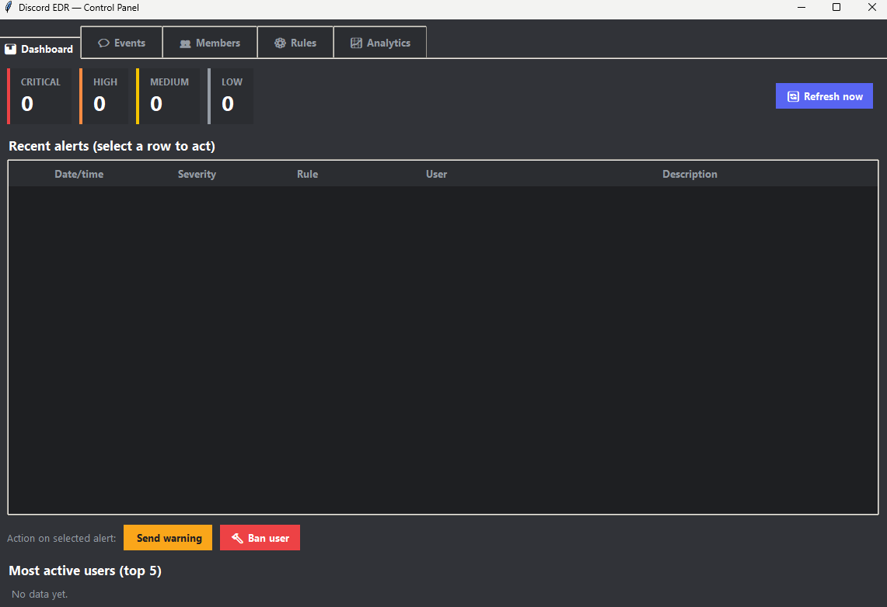

# DiscordEDR

A local monitoring app for Discord servers. It records events into a
local SQLite database and a text log, and applies simple detection rules.

## Structure

```
discord-edr/
├── bot/
│   ├── main.py              # entry point, registers discord.py events
│   ├── config.py            # configuration and detection rules
│   ├── logger.py            # file + console logging
│   ├── detection.py         # fixed rule engine (spam, mass mention, raid join...)
│   ├── rule_engine.py       # dynamic, editable rule engine (keywords, links, load)
│   ├── backup.py            # automatic SQLite backups
│   ├── db/
│   │   └── database.py      # SQLite layer (events, alerts, members, pending_actions)
│   └── events/
│       ├── message_events.py  # message create/edit/delete handlers
│       └── member_events.py   # join/leave/ban/update handlers
├── desktop_app/
│   ├── app.py                # Tkinter desktop panel (dashboard, events, members, rules, analytics)
│   ├── bot_runner.py          # starts/stops the bot on a background thread
│   └── theme.py               # Discord-style dark theme for the panel
├── data/                     # edr.db and rules.json are created here (not committed to git)
├── logs/                      # edr.log is created here
├── requirements.txt
├── .env.example
├── run_app.py                 # single entry point: launches the desktop panel (which starts the bot)
└── .gitignore
```

> **Note on this copy:** every module referenced above (`bot/db/database.py`,
> `bot/events/message_events.py`, `bot/events/member_events.py`, plus the
> rest of `bot/` and `desktop_app/`) has been fully translated and
> documented in English.

## Installation

1. Create a bot application at https://discord.com/developers/applications
   - Under "Bot" → enable **MESSAGE CONTENT INTENT** and **SERVER MEMBERS INTENT**.
   - Copy the bot token.
   - Under "OAuth2 → URL Generator" check `bot` and the permissions: View
     Channels, Read Message History, Send Messages, View Server Members.
     Use the generated URL to invite it to your server.

2. Install dependencies (a virtual environment is recommended):
   ```bash
   cd discord-edr
   python -m venv venv
   source venv/bin/activate        # on Windows: venv\Scripts\activate
   pip install -r requirements.txt
   ```

3. Set up environment variables:
   ```bash
   cp .env.example .env
   # edit .env and add your DISCORD_TOKEN
   ```

4. Run the app (starts the desktop panel, which starts the bot in the background):
   ```bash
   python run_app.py
   ```
   Or run the bot on its own, without the desktop panel:
   ```bash
   python -m bot.main
   ```

## Usage

- The bot automatically logs everything to `data/edr.db` (SQLite) and
  `logs/edr.log`.
- From Discord, an administrator can type `!edr alertas 15` to see the last
  15 detected alerts.
- You can inspect the database with any SQLite client, for example:
  ```bash
  sqlite3 data/edr.db "SELECT * FROM alerts ORDER BY id DESC LIMIT 20;"
  ```



## Running the graphical environment (desktop panel)

The graphical panel (`desktop_app/`) is built with **Tkinter** (bundled
with Python, nothing extra to install on Windows/Mac) and **matplotlib**
for the chart on the Analytics tab. Opening the panel automatically starts
the bot in the background — there's no need to run the bot separately.

### Prerequisites

- Have completed steps 1–3 of [Installation](#installation)
  (dependencies installed and `.env` with your `DISCORD_TOKEN`).
- On **Linux**, Tkinter may not come preinstalled with Python. If you see
  an error like `ModuleNotFoundError: No module named 'tkinter'` on
  startup, install it with:
  ```bash
  sudo apt install python3-tk
  ```
- Activate your virtual environment if you're using one:
  ```bash
  source venv/bin/activate        # on Windows: venv\Scripts\activate
  ```

### Launching the panel

From the project root, either of these two commands opens the graphical
interface:

```bash
python run_app.py
```

or, equivalently, calling the panel's module directly:

```bash
python -m desktop_app.app
```

Both do the same thing: they open the panel window and, as soon as it
opens, it starts the Discord bot on a background thread (see
`desktop_app/bot_runner.py`). The bot's connection status ("Connecting...",
"Connected as...", or an error if the token is missing) is shown in the
bottom-right corner of the status bar.

If you'd rather run **only the bot**, without opening any window (for
example on a server with no graphical environment), use instead:

```bash
python -m bot.main
```

### Closing the panel

Closing the window (❌) stops the bot cleanly before exiting — there's no
need to kill the process manually.

### Packaging as an executable (.exe)

`run_app.py` is the same file intended to be packaged with PyInstaller to
produce a single double-click `.exe` (see `docs/BUILD_EXE.md` if it exists
in your copy of the project), so the graphical environment can be
distributed without whoever uses it having to install Python.

## Desktop panel

Besides the bot, the project includes a desktop dashboard (`desktop_app/`)
built with Tkinter (bundled with Python — nothing extra to install on
Windows/Mac; on Linux you may need `sudo apt install python3-tk`) plus
`matplotlib` for the analytics chart.

It reads directly from the SQLite database and the rules file — the bot and
the panel can run side by side without conflicts, and opening the panel
also starts the bot for you (see `desktop_app/bot_runner.py`), so
`python run_app.py` is normally all you need.

Tabs:

- ** Dashboard** — alert counters by severity, a table of recent alerts
  (color-coded by severity), and the most active users. Auto-refreshes
  every 3 seconds. You can warn or ban the user behind a selected alert
  directly from here.
- ** Eventos** — full history of messages/edits/deletions/joins, with a
  filter by event type and a search box by user or content.
- ** Miembros** — who's in the server, when they joined, when their
  account was created, and whether they've left (shown greyed out). You can
  kick, ban, timeout, or warn a selected member, and view their moderation
  history.
- ** Reglas** — the same rule administration as the Discord commands, but
  visual: add/remove watched keywords, enable/disable link detection and
  manage its whitelist, and create/delete load (flood) rules. Changes save
  instantly to `data/rules.json` and the bot picks them up on the next
  message it evaluates (it reloads the file on every evaluation).
- ** Analítica** — a stacked bar chart of alerts per day/severity over a
  selectable range, plus rankings of the rules and users generating the
  most alerts, and CSV export for both events and alerts.

## Configurable rules (live commands)

Besides the fixed rules, you can create your own rules directly from
Discord without touching any code. They're stored in `data/rules.json` and
applied instantly. All commands require **administrator** permission:

| Command | What it does |
|---|---|
| `!edr addword <word> [severity] [borrar:si/no]` | Adds a watched keyword. E.g.: `!edr addword "banned word" high si` |
| `!edr delword <id>` | Removes a watched keyword by its id |
| `!edr words` | Lists the currently watched keywords |
| `!edr links on\|off [severity]` | Enables/disables generic link detection (any http/https, not just Discord invites) |
| `!edr whitelist add\|del <domain>` | Adds/removes an allowed domain (e.g. `youtube.com`) that won't trigger an alert |
| `!edr addload user\|channel <max_messages> <window_seconds> [severity]` | Creates a load/flood rule. E.g.: `!edr addload user 6 8 high` = alert if a user sends 6+ messages in 8s |
| `!edr delload <id>` | Removes a load rule by its id |
| `!edr loads` | Lists the currently configured load rules |
| `!edr reglas` | Summary of all currently active configurable rules |

Valid severities: `low`, `medium`, `high`, `critical`.

If a keyword or link is marked with `borrar:si` (or `delete_message: true`
in the JSON), the bot also automatically deletes the message in addition to
raising the alert (requires the bot to have the "Manage Messages"
permission on the server).

### Example generated `data/rules.json`

```json
{
  "keywords": [
    {"id": "a1b2c3d4", "word": "banned word", "whole_word": true,
     "case_sensitive": false, "severity": "high", "delete_message": true}
  ],
  "link_detection": {
    "enabled": true, "severity": "low", "delete_message": false,
    "whitelist_domains": ["youtube.com", "tenor.com"]
  },
  "load_rules": [
    {"id": "e5f6a7b8", "scope": "user", "max_messages": 6,
     "window_seconds": 8, "severity": "medium"}
  ]
}
```

You can also edit this JSON by hand and restart the bot to pick up the
changes.

## Built-in detection rules (fixed, not configurable via commands)

| Rule | What it detects | Severity |
|---|---|---|
| `message_spam` | Many consecutive messages from the same user in a short time | medium |
| `mass_mention` | A message mentioning a large number of users/roles at once | high |
| `invite_link` | Posting an invite link to another server | low |
| `raid_join` | Many new-member joins in a short time (possible raid) | critical |
| `new_account_join` | A very recently created account joining the server | low |
| `fast_post_link` | An account posting a link/invite seconds after joining (typical scam/nitro-bot pattern) | high |

All thresholds live in `bot/config.py` (`DETECTION_RULES`); tune them to
your liking.

## Known gaps / things fixed in this pass

- **`app.py` never actually called `bot_runner.start_bot()`**, even though
  the module docstring, `run_app.py`, and this README all describe the
  desktop panel as auto-starting the bot. This has been wired up: the
  panel now starts the bot on launch, shows its live connection status in
  the bottom-right corner of the status bar, and stops it cleanly when the
  window is closed.
- **`matplotlib` was missing from `requirements.txt`** despite being
  required by the Analytics tab — added.
- `build_exe.bat` and `start.bat` were empty in the files shared for this
  documentation pass, so they haven't been reviewed here.

## Possible next steps

- A local web dashboard (e.g. with Flask) to visualize `data/edr.db`.
- Automatic notifications to an alert channel (`ALERT_CHANNEL_ID` in `.env`).
- Additional rules: suspicious webhooks, mass permission changes, etc.
- Scheduled activity reports (CSV/PDF export on a timer).
